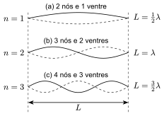
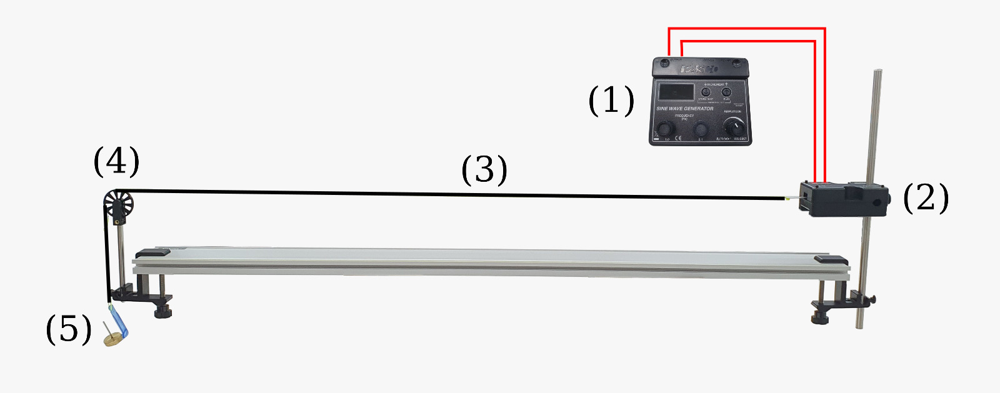

::: {.content-visible when-format="html"}
## Introdução

Ondas estacionárias formam-se pela interferência de duas ondas progressivas idênticas que se propagam em sentidos opostos no mesmo meio, como ocorre em uma corda esticada cujas extremidades refletem as ondas geradas por uma fonte vibrante. Quando a frequência da vibração coincide com um dos valores de ressonância, surgem padrões estáveis de oscilação — as ondas estacionárias — caracterizados pela presença de nós, pontos de amplitude nula, e ventres ou anti-nós, onde a amplitude é máxima, correspondendo aos diferentes modos naturais de vibração da corda [@Halliday2].


::: {}
{#fig-modos-naturais width="55%"}

<div style="text-align: center; font-size: smaller">
  **Fonte:** Labfis (2026)
</div>
:::

Como ilustrado na @fig-modos-naturais, para cada modo de oscilação da onda estacionária, o comprimento de onda ($\lambda$) satisfaz a seguinte relação:

$$
  \lambda = \dfrac{2L}{n}, \quad \text{ para }  n = 1, 2, 3, \cdots
$${#eq-lambda-n}

em que $n$, denominado *número harmônico*, é a quantidade de ventres observados na onda.

Lembrando que para qualquer onda com comprimento de onda $\lambda$ e frequência $f$, a velocidade de propagação da onda, $v$, é dada por:

$$
  v = \lambda f
$${#eq-vel-lambda-f}

Substituindo $\lambda$ da @eq-lambda-n na @eq-vel-lambda-f,

$$
  f = \dfrac{v}{2L} n, \quad \text{ para } n = 1, 2, 3, \cdots
$${#eq-fvLn}


Por outro lado, se a corda tem massa $m$ e comprimento total $l$ e está fujeita a uma força de tensão $F$, a velocidade $v$ de propagação da onda também pode ser determinada pela relação:

$$
  v = \sqrt{\dfrac{F}{\mu}}
$${#eq-vel-tensao-mu}

em que $\mu = \dfrac{m}{l}$ é a _massa específica linear_ da corda.

Substituindo $v$ da @eq-vel-tensao-mu na @eq-fvLn, obtemos a seguinte expressão para as frequências de ressonância em função do número harmônico $n$:

$$
  f = f_1 \cdot n
$${#eq-f-ressonancia}

em que

$$
  f_1 = \dfrac{1}{2L} \sqrt{\dfrac{F}{\mu}}
$${#eq-primeiro-harmonico}

é denominado *primeiro harmônico* ou *frequência fundamental*. Note que, de acordo com a @eq-f-ressonancia, cada modo de oscilação é um múltiplo inteiro do primeiro harmônico $f_1$.

Neste experimento, ondas estacionárias são geradas em uma corda esticada,por meio de vibrações de um gerador de ondas senoidais acionado eletricamente. A disposição do aparelho é mostrada na @fig-kit-ondas. A tensão na corda é igual ao peso das massa suspensa sobre a polia.


## Objetivos

1. Compreender a relação entre a frequência, o comprimento da corda, a tensão e os diferentes modos de vibração (harmônicos) das ondas estacionárias;
2. Determinar a velocidade de propagação de uma onda estacionária em uma corda vibrante.

## Material Necessário

::: {}
{#fig-kit-ondas}
<div style="text-align: center; font-size: smaller">
  **Fonte:** Labfis (2026) 
</div>
:::

- Gerador de ondas senoidais (1);
- Gerador de vibrações (2);
- Fio trançado inelástico (3);
- Polia e haste (4);
- Conjunto de massa e suporte (5);
- Trena, balança digital e acessórios.


## Referências

:::{#refs}
:::
::::


```{=typst}
#show bibliography: it => {
  show heading: none
  it
}

= Introdução

Ondas estacionárias formam-se pela interferência de duas ondas progressivas idênticas que se propagam em sentidos opostos no mesmo meio, como ocorre em uma corda esticada cujas extremidades refletem as ondas geradas por uma fonte vibrante. Quando a frequência da vibração coincide com um dos valores de ressonância, surgem padrões estáveis de oscilação — as ondas estacionárias — caracterizados pela presença de nós, pontos de amplitude nula, e ventres ou anti-nós, onde a amplitude é máxima, correspondendo aos diferentes modos naturais de vibração da corda #cite(<Halliday2>).


#figure(
  caption: [Frequências naturais em uma corda vibrante],
  image("assets/images/typst/modos-naturais.svg")
)<fig-modos-naturais>
#align(center)[#text(size: 10pt)[Fonte: Labfis (2026)]]

Como ilustrado na @fig-modos-naturais, para cada modo de oscilação da onda estacionária, o comprimento de onda ($lambda$) satisfaz a seguinte relação:

$
  lambda = (2L)/(n), "para " n = 1, 2, 3, dots
$<eq-lambda-n>

#par(first-line-indent: 0em)[
  em que $n$, denominado *número harmônico*, é a quantidade de ventres observados na onda.
]

Lembrando que para qualquer onda com comprimento de onda $lambda$ e frequência $f$, a velocidade de propagação da onda, $v$, é dada por:

$
  v = lambda f
$<eq-vel-lambda-f>

Substituindo $lambda$ da @eq-lambda-n na @eq-vel-lambda-f,

$
  f = (v)/(2L) n, "para " n = 1, 2, 3, dots
$<eq-fvLn>


Por outro lado, se a corda tem massa $m$ e comprimento total $l$ e está fujeita a uma força de tensão $F$, a velocidade $v$ de propagação da onda também pode ser determinada pela relação:

$
  v = sqrt(F/mu)
$<eq-vel-tensao-mu>

#par(first-line-indent: 0cm)[
  em que $mu = display(m/l)$ é a _massa específica linear_ da corda.
]

Substituindo $v$ da @eq-vel-tensao-mu na @eq-fvLn, obtemos a seguinte expressão para as frequências de ressonância em função do número harmônico $n$:

$
  f = f_1 dot n
$<eq-f-ressonancia>

#par(first-line-indent: 0em)[em que]

$
  f_1 = 1/(2L) sqrt(F/mu)
$<eq-primeiro-harmonico>
#par(first-line-indent: 0em)[
  é denominado *primeiro harmônico* ou *frequência fundamental*. Note que, de acordo com a @eq-f-ressonancia, cada modo de oscilação é um múltiplo inteiro do primeiro harmônico $f_1$.
]

Neste experimento, ondas estacionárias são geradas em uma corda esticada,por meio de vibrações de um gerador de ondas senoidais acionado eletricamente. A disposição do aparelho é mostrada na @fig-kit-ondas. A tensão na corda é igual ao peso das massa suspensa sobre a polia.


= Objetivos

+ Compreender a relação entre a frequência, o comprimento da corda, a tensão e os diferentes modos de vibração (harmônicos) das ondas estacionárias;
+ Determinar a velocidade de propagação de uma onda estacionária em uma corda vibrante.


= Material Necessário

#figure(
  caption: [Aparato experimental],
  image("assets/images/equipamento-ondas-pasco.png")
)<fig-kit-ondas>
#align(center)[#text(size: 10pt)[Fonte: Labfis (2026)]]

- Gerador de ondas senoidais (1);
- Gerador de vibrações (2);
- Fio trançado inelástico (3);
- Polia e haste (4);
- Conjunto de massa e suporte (5);
- Trena, balança digital e acessórios.

#v(2cm)
= Procedimentos

//#info-box([Atenção], [Conteúdo])
Siga os passos seguintes e preencha a @tbl-dados.


#figure(
  kind: table,
  caption: [Coleta de dados]
)[
  #set table(
    align: left,
    fill: (x, y) => 
      if x==0 {
        primary-color.transparentize(60%)
      } else if calc.rem(y, 2) == 0 {
        primary-color.transparentize(80%)
      }
  )
  #show table.cell.where(x: 0): strong
  #show table.cell.where(y: 0): none
  #table(
    columns: (2fr, 4fr),
    [], [],
    [$m$ (kg)], [],
    [$l$ (m)], [],
    [$mu$ (kg/m)], [],
    [$M$ (kg)], [],
    [$F$ (N)], [],
    [$L$ (m)], [],
    [$f_(1"(esp)")$ (Hz)], [],
  )
]<tbl-dados>


+ Com a balança digital, determine a massa $m$ do fio e com a trena, meça o respectivo comprimento total $l$. Use essas informações para calcular a massa específica $mu$ da corda. 

+ Com a balança digital, determine a massa suspensa pela polia $M$. Calcule a tensão $F = M\g$ à qual a corda está submetida.

+ Prenda uma extremidade da corda à haste metálica do gerador de vibrações.

+ Na outra extremidade da corda, prenda o suporte com a massa externa $M$ , passando essa extremidade pela polia, conforme mostrado na @fig-kit-ondas.

+ Com a trena, meça a distância $L$ entre o orifício da haste metálica do gerador de vibrações e a polia.

+ Utilizando a @eq-primeiro-harmonico, determine valor esperado para o primeiro harmônico $f_(1"(esp)")$.

#pagebreak()

  #info-box([Atenção], [

    #figure(
      cetz.canvas({
        import cetz.draw: *
        content((0,0),
          image("assets/images/gerador-de-ondas.png", width: 5cm)
        )
        line((-2.5, -2.5), (-1.7,-1.4), mark: (end: "stealth"), fill:black, stroke: 2pt, name: "ajuste-grosso")
        content("ajuste-grosso.start", anchor: "north", padding: 0.1, [
          #text(size: 9pt)[#align(center)[Pré-ajuste\ de Frequência\ Passo: 1 Hz]]
        ])
        line((-0.05, -2.5), (-0.05, -1.4), mark: (end: "stealth"), fill: black, stroke: 2pt, name: "ajuste-fino")
        content("ajuste-fino.start", anchor: "north", padding: 0.1, [
          #text(size: 9pt)[#align(center)[Ajuste Fino\ de Frequência\ Passo: 0,1 Hz]]
        ])
        line((2.3, -2.5), (1.5, -1.4), mark: (end: "stealth"), fill: black, stroke: 2pt, name: "ajuste-amplitude")
        content("ajuste-amplitude.start", anchor: "north", padding: 0.1, [
          #text(size: 9pt)[#align(center)[Ajuste de\ Amplitude]]
        ])
      })
    )

  ])


+ Ligue o gerador de ondas senoidais e ajuste a frequência $f$ de tal modo que o padrão de ondas estacionárias corresponda seja semelhante ao mostrado na @fig-modos-naturais(a), equivalente a *meio* comprimento de onda, (_primeiro harmônico_ ou _frequência fundamental_), correspondente a $n = 1$. Anote o valor na @tbl-f-vs-n.

  #figure(
    kind: table,
    caption: [Frequências de ressonância observadas para cada valor de $n$]
  )[

    #table(
      columns: 2,
      table.header([$n$], [$f$ (Hz)]),
      [$1$], [],
      [$2$], [],
      [$3$], [],
      [$4$], [],
      [$5$], [],
    )
  ]<tbl-f-vs-n>

+ Repita o passo anterior para os demais modos de vibração: $n = 2, 3, 4$ e $5$ e complete a @tbl-f-vs-n. De posse desses dados, construa o gráfico da frequência de ressonância $f$ (eixo vertical $y$) em função do modo de vibração $n$ (eixo horizontal $x$).


= Análise de Dados

+ Determirmine a equação da reta que melhor se ajuste aos pontos do gráfico  construido no item anterior. Comparando a equação geral da reta $y = A x + B$ com a equação @eq-f-ressonancia, devemos veridicar que o coeficiente linear deve ser nulo ($B = 0$). Por outro lado , o coeficiente angular da reta  corresponderá ao valor experimental para o primeiro harmônico, ou seja, $A = f_(1"(obs)")$.

#figure(
  caption: [Ajuste linear para relação $f times n$],
  image("assets/images/typst/grafico-ajuste-linear.svg")
)<fig-ajuste-linear>
#align(center)[#text(size: 10pt)[Fonte: Labfis (2026)]]

+ Compare os dois valores de velocidade nos items acima. Utilize a @eq-desvio-perc para calcular o desvio percentual entre os valores obtidos.

$
  Delta D (%) = abs( (f_(1"(obs)") - f_(1"(esp)")) / (f_(1"(esp)"))) times 100 %
$<eq-desvio-perc>

#figure(
  kind: table,
  caption: [Análise de Resultados]
)[
  #table(
    columns: (1fr, 1fr, 1fr),
    table.header([$f_(1"(esp)")$ (Hz)], [$f_(1"(obs)")$ (Hz)], [$Delta D (%)$]),
    [$$]
  )
]


#set heading(numbering: none)
= Referências

#bibliography("assets/references/references.bib", style: "assets/references/abnt.csl", title: none)
```